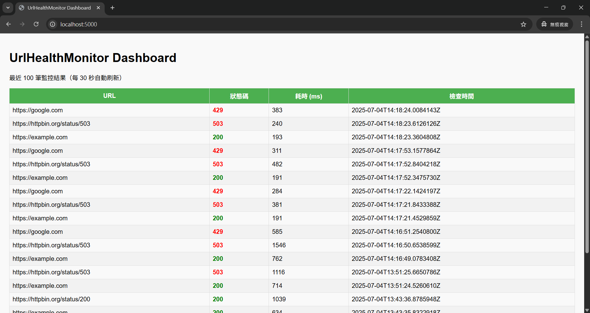

# UrlHealthMonitor
一款基於 .NET 8 的網址健康檢查工具，具備 HTTP 狀態碼監控、響應時間測量與結果持久化功能。專案包含單元測試（TDD 實踐），並已容器化可部署於 Docker 環境。


## 功能特色
* 批次檢查多個網址，可由命令列參數或環境變數輸入。
* 支援 HTTP GET 請求並回傳狀態碼與響應時間。
* 將檢查結果寫入 SQLite 資料庫，方便歷史數據保存與分析。
* 完整單元測試流程，體現 TDD 開發實踐。
* Docker 化，方便跨平台部署。
* 支援透過環境變數設定資料庫路徑與目標網址。
* 可掛載本機目錄，保存資料庫文件。

## 技術棧與重點
| 技術          | 用途說明                                          |
| ----------- | --------------------------------------------- |
| C# / .NET 8 | 核心程式語言與框架                                     |
| HTTP 協議     | 使用 HttpClient 發送 HTTP GET 請求，理解 HTTP 狀態碼及回應機制 |
| TDD         | 單元測試編寫與執行，確保功能正確                              |
| SQLite      | 輕量級資料庫保存檢查結果                                  |
| Dapper      | ORM 簡化資料庫操作                                   |
| Docker      | 容器化應用，實現跨平台部署                                 |

## 快速開始

### 查看
```
# 啟動容器，外部使用localhost:5001 連進去，內部服務跑在容器的 5000 端口。
docker run -d -p 5001:5000 --name urlhealthmonitor urlhealthmonitor

# 新增你要檢查的網站
docker exec -it urlhealthmonitor dotnet UrlHealthMonitorApp.dll add <你的URL>

# 移除你要檢查的網站
docker exec -it urlhealthmonitor dotnet UrlHealthMonitorApp.dll remove <你的URL>
```

### 本地測試 (需安裝 .NET 8 SDK)
```bash
git clone https://github.com/reedlin2002/UrlHealthMonitorApp.git
cd UrlHealthMonitorApp/UrlHealthMonitorApp

# 還原套件
dotnet restore

# 執行測試（TDD）
dotnet test

# 執行程式（可帶多個網址，逗號分隔）
dotnet run -- "https://www.youtube.com/,https://httpbin.org/status/404"

#使用localhost:5000 連進去
donet run --serve  ()
```

### Docker 建置與執行
```bash
# 在 UrlHealthMonitorApp 專案根目錄執行
docker build -t urlhealthmonitor .

# 建立本機資料夾用於保存資料庫
mkdir -p ./data

# 執行容器，帶入網址參數並掛載本機資料夾
docker run --rm -v ${PWD}/data:/app/data -e DATABASE_PATH=/app/data/results.db urlhealthmonitor "https://www.youtube.com/,https://httpbin.org/status/404"
```

> Windows PowerShell 注意路徑格式：
`docker run --rm -v C:/Users/JerryLin/Desktop/UrlHealthMonitor/data:/app/data -e
DATABASE_PATH=/app/data/results.db urlhealthmonitor
"https://www.youtube.com/,https://httpbin.org/status/404"`

## TDD 與測試說明
使用 xUnit + FluentAssertions 撰寫測試。

透過測試模擬 HTTP 請求回應，驗證狀態碼與超時邏輯。

資料庫操作也有測試，確保寫入正確。

建議持續在開發新功能時，先寫測試再實作，確保品質。

## 未來可擴展方向
改寫為 RESTful Web API，方便前端和其他系統整合。

增加定時排程與通知（Email/Slack/LINE）。

加入使用者管理與多專案支持。

增加監控數據視覺化面板。

